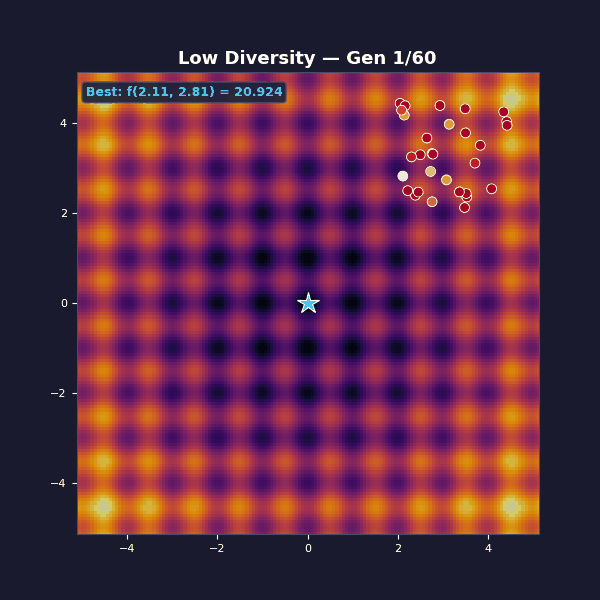
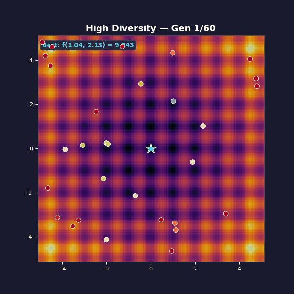
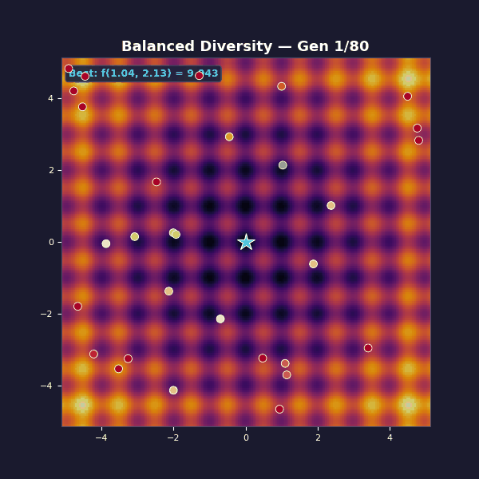

*By entity["people","Jack Foxabbott","technical staff author"], Founding Member of Technical Staff*

# Diversity Is All You Need (To Converge)

Evolutionary algorithms are simple. Maintain a population. Evaluate fitness. Keep the best. Mutate to create offspring. Repeat.

Most introductions stop there.

They shouldn’t.

The loop isn’t the hard part. **Controlling how diverse the population stays as the algorithm runs** is the hard part. Selection wants to collapse the population into a monoculture. Mutation wants to smear it back out. If you don’t manage that tension you either (i) collapse into a local optimum and sit there, or (ii) keep “exploring” forever and never cash it in. citeturn20view0

This post goes deeper than the usual slogan. We’ll do two things:

First, we’ll build intuition on a continuous, brutally multimodal landscape (Rastrigin). citeturn21search0turn21search4turn21search17

Second, we’ll anchor that intuition in **five precise theoretical results** about *convergence speed* (expected optimisation time / fitness evaluations) and how it depends on the exploration–exploitation balance. These results are mostly proved on stylised “toy” landscapes (bit strings, synthetic traps), because that’s where the maths is sharp enough to separate **polynomial-time** from **exponential-time** behaviour. The point isn’t that your real objective *is* OneMax or Jump. The point is that these proofs pin down exactly when “keep the best and mutate” is fast, slow, or outright doomed. citeturn16view0turn18view2turn19view0

(Visual: a 2D “phase diagram” with selection pressure on one axis and mutation strength on the other, showing three regions labelled *premature convergence*, *random search*, and *useful search*.)

## The Rastrigin function

The Rastrigin function is a standard optimisation test problem because it’s **regularly packed with local minima**: it looks like a rippled bowl, where the global best point is the bottom of the bowl, but there are countless tempting dents along the way. citeturn21search0turn21search17turn21search4

In two dimensions, one common form is:

\[
f(x, y) = 20 + (x^2 - 10\cos(2\pi x)) + (y^2 - 10\cos(2\pi y)).
\]

The global minimum is at \((0,0)\) with \(f(0,0)=0\). citeturn21search0turn21search17turn21search1

```python
def rastrigin(x, y, A=10):
    return (A * 2
            + (x**2 - A * np.cos(2 * np.pi * x))
            + (y**2 - A * np.cos(2 * np.pi * y)))
```

We ran the same EA three times, varying two knobs:

- **Selection pressure** (how aggressively we copy “the best” into the next generation).
- **Mutation strength** (how far offspring can jump from their parents).

Everything else was identical: population size 30, elitism (always keep the best individual found so far), Gaussian mutation. The only thing changing is how quickly selection collapses diversity, versus how quickly mutation replenishes it.

(Visual: same plot as the GIFs, but with a second panel showing two curves over time: *best fitness* and a simple diversity metric like population covariance / average pairwise distance.)

**Too little diversity** — tournament selection size 10 (very aggressive), Gaussian mutations with \(\sigma=0.15\).



The population collapses in a handful of generations. You get “fast convergence”… to the wrong thing. The mutation steps are too small to hop the ridges between basins. What looks like decisive progress is often just **selection doing what it always does: removing variety**.

**Too much diversity** — tournament selection size 2 (weak), Gaussian mutations with \(\sigma=3.5\).



Now you get the opposite failure mode. Diversity is maximal, but unstructured: each generation is basically a fresh random sample. Selection isn’t strong enough to amplify improvements into a stable lineage, so the algorithm can’t compound its gains.

**Balanced diversity** — tournament selection size 5, mutation schedule that starts large and shrinks:

\[
\sigma(t) = 1.2 \cdot \bigl(1 - 0.8\, t/T\bigr).
\]



This is the only regime where the population is *diverse enough early* to escape bad basins, but *stable enough late* to exploit what it finds.

That empirical pattern is familiar. What’s less familiar is that, on the right simplified models, you can prove the same pattern: **get the balance wrong and your runtime goes from polynomial to exponential**.

## Exploration and exploitation are two clocks

There are many ways to describe “exploration vs exploitation”. The theory literature often boils it down to two time scales—the two clocks your EA is running on at all times.

The first clock is **takeover**: how quickly selection can fill the population with copies of the current best type *even if you turn mutation off*. This is exploitation speed, and it is also (crucially) a quantitative description of how quickly diversity disappears. citeturn15view0turn20view0

The second clock is **escape / discovery**: how quickly variation operators can produce something genuinely different (a new basin, a new building block, a gap-crossing move) *despite* selection trying to prune it away. This is exploration speed. On some landscapes, escape requires a rare event (e.g., flipping \(k\) specific bits at once, or jumping a specific ridge), so the escape clock can easily become exponential if the population has collapsed. citeturn18view2turn16view0

A good diversity strategy is not “maximise diversity”. It’s “make sure the escape clock beats the takeover clock early, then let takeover/selection win later”.

(Visual: two curves—expected takeover time vs expected escape time—to illustrate regimes where one dominates.)

## Five theoretical results about convergence speed

Below are five results that turn the hand-wavy story into mathematics. Most are proved for bit-string EAs, because that’s where we can say “polynomial” or “exponential” without hand-waving. Don’t get distracted by the discrete setting: the *mechanism* is what matters.

### Elitism gives convergence, but not speed

> **Result (Rudolph, 1994).** A canonical GA without elitism “will never converge to the global optimum”. Adding elitism yields probabilistic convergence to the global optimum under standard irreducibility conditions. citeturn2view1

This is the cleanest separation between *eventual convergence* and *useful convergence*.

Without elitism, the GA is an ergodic Markov chain over populations: it might hit an optimum, but it can also leave it, forever. With elitism, “having seen the best-so-far” becomes an absorbing property: once discovered, it’s never forgotten. citeturn2view1

But notice what this does **not** say: it says nothing about how many evaluations you need before you ever see the global optimum. In other words, elitism turns “maybe we keep it” into “we keep it”, but it doesn’t stop the runtime from being astronomically large.

That’s exactly what the Rastrigin GIFs demonstrate: elitism is on in all three runs, but only the balanced one is fast *in any practical sense*.

(Visual: a simple Markov-chain diagram showing “optimum state” as non-absorbing without elitism and absorbing with elitism.)

### Selection pressure has a closed-form “diversity half-life”

A lot of blog posts treat selection pressure as vibes. The runtime literature treats it as a number.

A classic measure is **takeover time**: the expected number of selection iterations needed until the population consists entirely of copies of the initially-best individual (assuming it can’t go extinct). citeturn15view0turn20view0

> **Result (Rudolph, 2000).** For a population of size \(n\), non-generational tournament selection takes on the order of \(n\log n\) selection iterations to fully “take over”. Concretely:
>
> - binary tournament: \(E[T] = n H_{n-1}\),
> - ternary tournament: \(E[T] = \tfrac{2}{3} n H_{n-1}\),
>
> where \(H_{n-1}\) is the \((n-1)\)-th harmonic number (so \(H_{n-1}\approx \log(n)\)). citeturn15view0

This is a blunt quantitative fact: **stronger tournaments shrink takeover time by a constant factor**. You get faster exploitation, and also faster loss of diversity. citeturn15view0

The reason this matters for convergence *speed* is simple: once takeover happens, crossover starts recombining near-clones and mutation becomes the only source of novelty. At that point, you’re effectively running a hillclimber with a particular step size distribution—often exactly the “too little diversity” regime from the Rastrigin demo.

(Visual: logistic-style growth curves of “fraction of best individuals” for tournament sizes 2, 3, 4; annotate takeover time.)

### Mutation rate has a phase transition: beyond it, runtime explodes

Now for an exploration knob that’s been studied to death: the **mutation probability** \(p\) in standard bitwise mutation.

Even on extremely friendly landscapes (linear functions), you can prove a sharp threshold: if you mutate too aggressively, you destroy good structure faster than selection can exploit it, and the expected optimisation time becomes superpolynomial.

> **Result (Witt, 2013).** For the \((1+1)\) EA (elitist selection, one offspring per step) on *any* linear function:
>
> - If \(p = \omega((\ln n)/n)\), the expected optimisation time is superpolynomial.
> - If \(p = O((\ln n)/n)\) (and not astronomically tiny), the expected optimisation time is polynomial.
> - If \(p = c/n\) for constant \(c>0\), then \(E[T] = (1\pm o(1))\frac{e^{c}}{c}\,n\ln n\), and the asymptotic optimum is attained at \(p\approx 1/n\). citeturn16view0

There are two big takeaways hiding in that theorem:

1. **There is an “exploration too high” regime where progress becomes provably inefficient.** When \(p\) is much bigger than \((\ln n)/n\), each mutation flips so many bits that improvements become too rare to keep a steady drift towards the optimum. citeturn16view0

2. **The “right” amount of exploration is not arbitrary—it is quantifiable**, and the optimum here occurs when the expected number of flipped bits per mutation is about 1. citeturn16view0

This is the discrete analogue of your Rastrigin knobs. If \(\sigma\) is huge, you’re effectively resampling; if \(\sigma\) is tiny, you can’t move between basins; and there’s a middle regime where the EA has a provable positive drift.

(Visual: a curve of the leading constant \(\frac{e^c}{c}\) vs \(c\) for \(p=c/n\), showing the minimum near \(c=1\), and then overlay a marker at the “phase transition” scale \(p\approx (\ln n)/n\).)

### Diversity plus crossover can change the exponent

Local optima are where “diversity management” stops being a slogan and starts being a runtime bound.

A standard theoretical trap is the Jump\(_k\) function: there is a broad plateau of local optima a Hamming distance \(k\) away from the unique global optimum. Mutation-only algorithms must “jump” the gap by flipping the right \(k\) bits in one lucky step. citeturn17view2turn18view2

> **Result (Dang et al., 2016).** On Jump\(_k\), the \((1+1)\) EA requires \(\Theta(n^k)\) fitness evaluations. For steady-state GAs with crossover, adding diversity-preserving mechanisms yields asymptotically smaller bounds; for constant \(k>2\) and constant crossover probability, several mechanisms admit \(O(n\log n)\) expected optimisation time under suitable parameter choices. citeturn18view2turn17view1turn17view3

This is the cleanest “diversity → speed” theorem I know, because the difference is not subtle. It is not “10% faster”. It is “you changed the scaling law”.

Why does diversity matter here?

Because crossover is only powerful when it recombines **different** parents. On Jump\(_k\), diversity mechanisms keep multiple *distinct* individuals alive on the plateau, so crossover can assemble the global optimum from complementary partial structures instead of waiting for a single miraculous \(k\)-bit mutation. citeturn2view2turn18view2

The negative, implicit corollary is just as important: if selection pressure collapses the population so that the plateau contains only near-identical individuals, crossover degenerates into “copy the same thing twice”, and you’re back to waiting \(\Theta(n^k)\). citeturn18view2

(Visual: a cartoon bitstring valley. Show two different plateau individuals each “missing” different bits, and a single crossover producing the optimum. Then show the monoculture case where crossover can’t help.)

### Self-adjustment can be provably optimal parameter control

The Rastrigin “balanced” run used a hand-designed decay schedule for \(\sigma(t)\). That’s fine. But there is also theory saying you can do better: let the algorithm **learn** its mutation strength online.

One particularly clean idea is: *try a slightly bigger step and a slightly smaller step, then keep whichever produced the best offspring.* That’s exploration and exploitation at the level of “parameter choice” rather than “search point choice”.

> **Result (Doerr et al., 2018).** Consider a \((1+\lambda)\) EA that, each generation, creates half its offspring with twice the current mutation rate and half with half, then updates the mutation rate based on the best-performing subpopulation. On OneMax, this self-adjusting EA finds the optimum in expected time \(O(n\lambda/\log \lambda + n\log n)\) fitness evaluations, asymptotically improving over the classic fixed-rate \((1+\lambda)\) EA. The paper also ties this to best-possible performance in the relevant \(\lambda\)-parallel black-box setting. citeturn19view0

The intuitive message is stronger than the bound:

- When progress is possible with small perturbations, the process drifts towards smaller mutation rates (exploitation).
- When it gets stuck, larger rates are more likely to win the “offspring tournament”, so the algorithm inflates its mutation rate (exploration). citeturn19view0

This gives a rigorous template for what we were doing heuristically on Rastrigin: start broad, then sharpen—except here, the sharpening is data-driven and provably near-optimal on a canonical benchmark.

(Visual: plot the mutation rate over time for multiple runs on OneMax; annotate “stagnation → rate increases” and “steady improvement → rate decreases”.)

## Mapping the demo to the theory

The Rastrigin GIFs are continuous and the theorems above are mostly discrete, but the lesson transfers because the failure modes are the same.

High selection pressure reduces the takeover time (fast exploitation), so diversity collapses early. Theorems about takeover time make that precise: even without mutation, tournament selection fills the population with copies in \(\Theta(n\log n)\) iterations, with constants that improve (i.e. speed up collapse) as you increase tournament size. citeturn15view0turn20view0

Weak selection pressure does the opposite: it keeps diversity but starves exploitation. The population doesn’t “remember” discoveries long enough for local search to compound them—so you get random walk behaviour on a rugged landscape. This is exactly the exploration–exploitation conflict raised in classical selection analyses. citeturn20view0

The balanced run works because it matches the pattern suggested by the runtime results:

- Use elitism so “discovering the best-so-far” is sticky. citeturn2view1
- Keep selection pressure moderate so takeover doesn’t annihilate diversity immediately. citeturn15view0
- Pick exploration strength that is big enough to escape basins early, but small enough to avoid destroying structure late (the mutation-rate phase transition is the discrete version of this). citeturn16view0
- If you have recombination, make sure the population stays meaningfully diverse; otherwise crossover is provably wasted on difficult landscapes like Jump\(_k\). citeturn18view2turn17view1
- Prefer adaptive schemes when you can, because there are now clean proofs that simple self-adjustment can track near-optimal exploration/exploitation settings on the fly. citeturn19view0

(Visual: a single figure with three stacked time-series plots—(i) best fitness, (ii) mean pairwise distance (diversity), (iii) mutation strength—showing the three regimes side-by-side.)

*All code to generate the animations in this post is in `animations/diversity_comparison.py`.*

## References

1. entity["people","Günter Rudolph","evolutionary computation"] (1994). *Convergence Analysis of Canonical Genetic Algorithms.* IEEE Transactions on Neural Networks. doi:10.1109/72.265964. citeturn2view1

2. Rudolph (2000). *Takeover Times and Probabilities of Non-Generational Selection Rules.* (Introduces closed-form takeover-time expressions for tournament selection.) citeturn15view0

3. entity["people","David E. Goldberg","genetic algorithms researcher"] and entity["people","Kalyanmoy Deb","evolutionary computation researcher"] (1991). *A Comparative Analysis of Selection Schemes Used in Genetic Algorithms.* (Selection pressure, takeover time, and explicit discussion of exploration vs exploitation.) citeturn20view0

4. entity["people","Carsten Witt","theoretical computer scientist"] (2013). *Tight Bounds on the Optimization Time of a Randomized Search Heuristic on Linear Functions.* (Mutation-rate threshold; \((1+1)\) EA runtime \(\approx e n \ln n\).) citeturn16view0

5. entity["people","Duc-Cuong Dang","computer scientist evolutionary computation"] et al. (2016). *Escaping Local Optima with Diversity Mechanisms and Crossover.* (Jump\(_k\): \((1+1)\) EA needs \(\Theta(n^k)\); diversity + crossover yields polynomial improvements.) citeturn2view2turn18view2

6. entity["people","Benjamin Doerr","computer scientist randomized algorithms"] et al. (2018). *The (1 + λ) Evolutionary Algorithm with Self-Adjusting Mutation Rate.* Algorithmica. doi:10.1007/s00453-018-0502-x. citeturn19view0

<!-- Based on the original draft in post.md fileciteturn0file0 -->