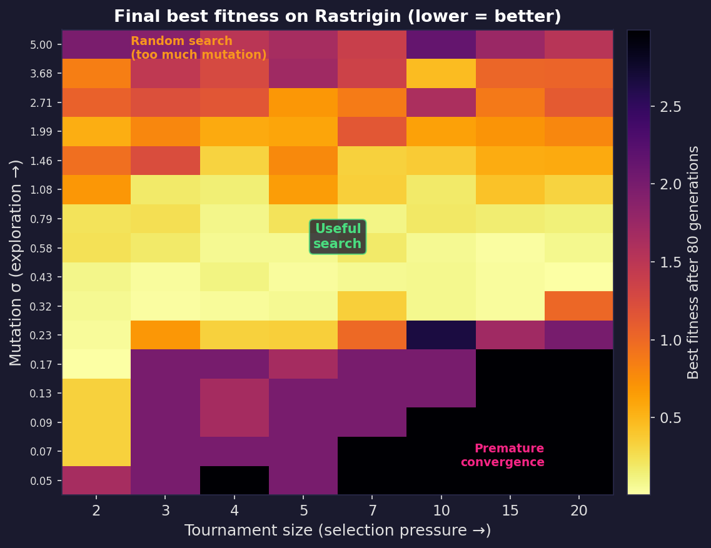
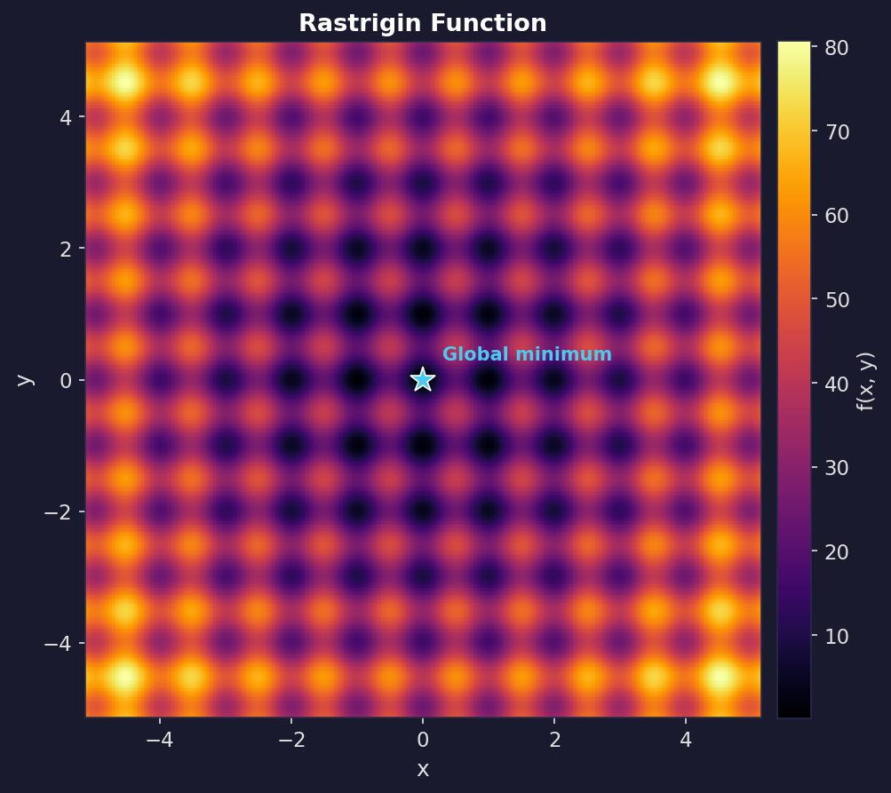
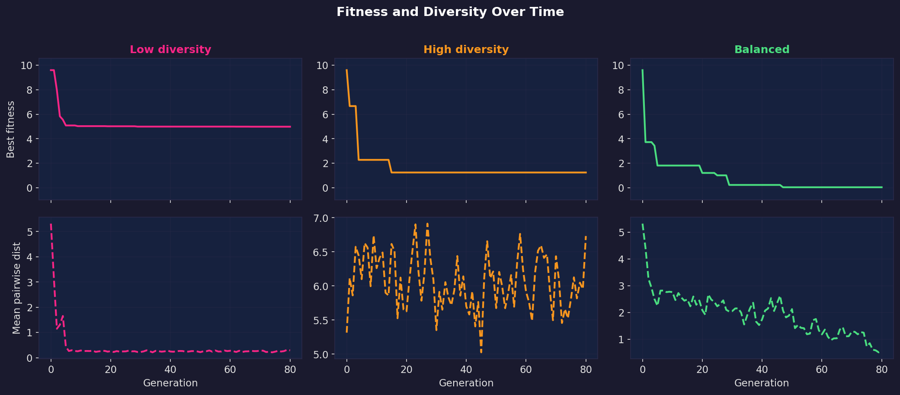
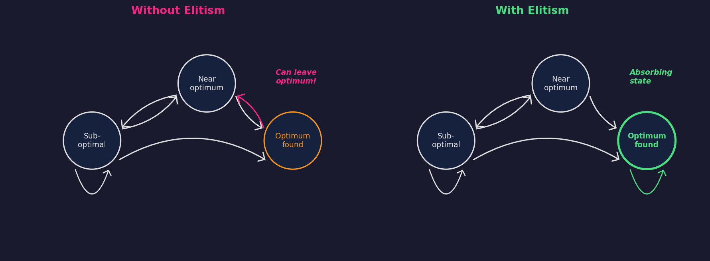
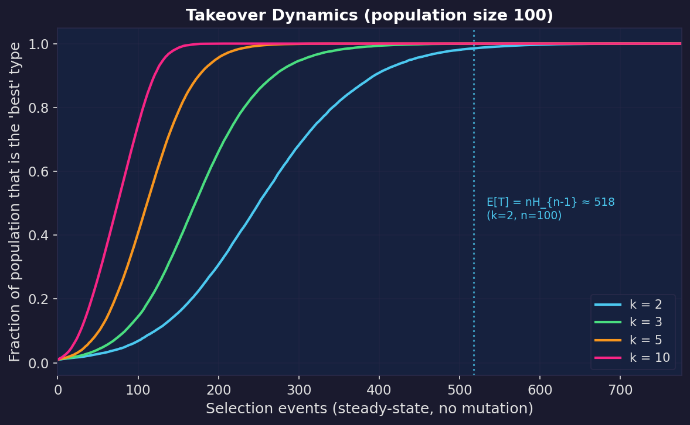
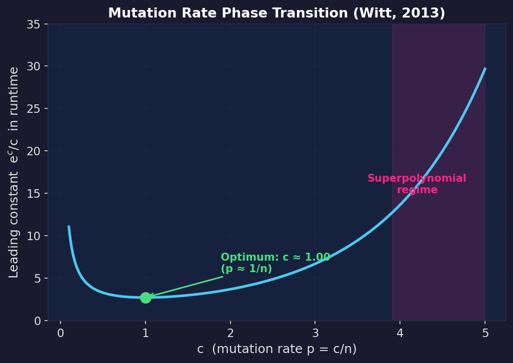
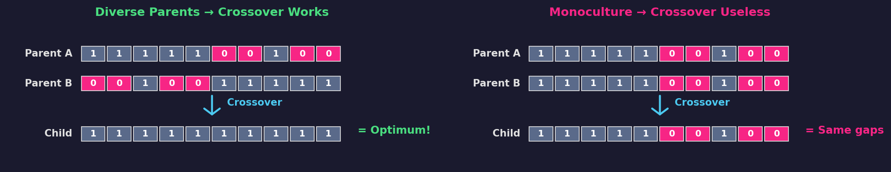
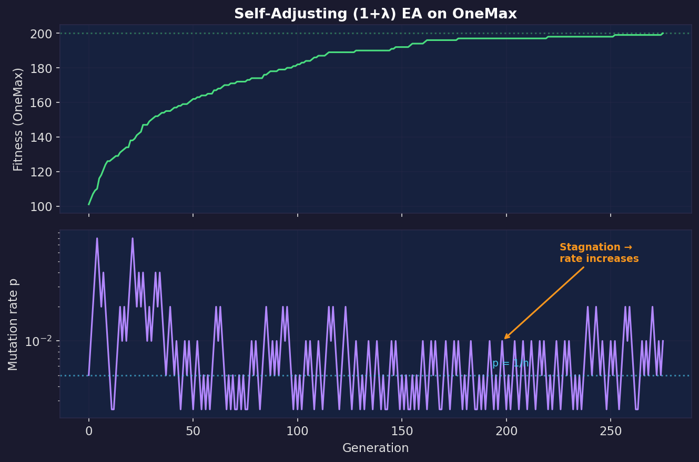

*By [Jack Foxabbott](https://www.linkedin.com/in/foxabbott/), Founding Member of Technical Staff*

# Diversity Is All You Need (To Converge)

Evolutionary algorithms are simple. Maintain a population. Evaluate fitness. Keep the best. Mutate to create offspring. Repeat.

But the loop isn't the hard part. **Controlling how diverse the population stays as the algorithm runs** is the hard part. Selection wants to collapse the population into a monoculture. Mutation wants to smear it back out. If you don't manage that tension you either collapse into a local optimum and sit there, or keep "exploring" forever and never cash it in.

We'll build intuition on a multimodal landscape (Rastrigin), then anchor that intuition in **five theoretical results** about convergence speed and how it depends on the exploration/exploitation balance. These results are mostly proved on stylised toy landscapes (bit strings, synthetic traps), because that's where the maths is sharp enough to separate polynomial-time from exponential-time behaviour. The proofs pin down exactly when "keep the best and mutate" is fast, slow, or outright doomed, and the mechanisms transfer to harder problems.

The plot below sweeps across selection pressure (tournament size) and mutation strength ($\sigma$), running the same EA on the Rastrigin function for each combination and recording the best fitness found. Dark cells reached the global optimum; bright cells got stuck. There's a narrow diagonal of good settings; too aggressive on either axis and the algorithm fails in opposite ways.

---

## The Rastrigin function

The Rastrigin function is a standard optimisation test problem because it's **regularly packed with local minima**: it looks like a rippled bowl, where the global best point is the bottom of the bowl, but there are many local dents along the way.

In two dimensions:

$$
f(x, y) = 20 + (x^2 - 10\cos(2\pi x)) + (y^2 - 10\cos(2\pi y)).
$$

The global minimum is at $(0,0)$ with $f(0,0) = 0$. Any greedy, hill-climbing algorithm gets stuck. It punishes algorithms that don't explore.

## The EA

We ran the same EA on the Rastrigin function three times, varying two knobs: **selection pressure** (how aggressively we copy the best into the next generation) and **mutation strength** (how far offspring can jump from their parents). Everything else was identical: population size 30, elitism (always keep the best individual found so far), Gaussian mutation. The only thing changing is how quickly selection collapses diversity, versus how quickly mutation replenishes it.

## Too little diversity

Tournament selection with size 10 (very aggressive, almost always picks the single best individual). Gaussian mutations with $\sigma = 0.15$.

The population collapses in a handful of generations. You get "fast convergence"... to the wrong thing. The mutation steps are too small to hop the ridges between basins. What looks like decisive progress is selection doing what it always does: removing variety.

## Too much diversity

Tournament selection with size 2 (almost random). Gaussian mutations with $\sigma = 3.5$.

The opposite failure mode. Diversity is maximal, but unstructured: each generation is basically a fresh random sample. Selection isn't strong enough to amplify improvements into a stable lineage, so the algorithm can't compound its gains. This is random search wearing an evolutionary costume.

## Balanced diversity

Tournament selection with size 5. Adaptive Gaussian mutations that start large and decay: $\sigma(t) = 1.2 \cdot (1 - 0.8\, t/T)$.

Early on, large mutations spread the population across the landscape. As the algorithm progresses, mutations shrink, focusing the population on the best basin. The global optimum is found.

Selection *exploits*: it copies what works. Mutation *explores*: it tries something new. The balanced case transitions from broad exploration to focused exploitation. The other two cases get stuck at one extreme.

## Seeing it in the numbers

The GIFs show the spatial story. The time-series below shows the quantitative story: best fitness and population diversity (average pairwise distance) over generations, for all three regimes side by side.

In the low-diversity run, diversity crashes immediately and fitness flatlines at a local optimum. In the high-diversity run, diversity stays high but fitness never improves because there's no exploitation. In the balanced run, diversity starts high and decays smoothly while fitness steadily drops toward zero. That smooth handoff from exploration to exploitation is what makes the balanced run work.

---

## Exploration and exploitation are two clocks

There are many ways to talk about "exploration vs exploitation". The theory literature boils it down to two time scales, two clocks your EA is running at all times.

**Clock 1: Takeover.** How quickly selection fills the population with copies of the current best type, *even if you turn mutation off*. This is exploitation speed. It's also a quantitative description of how quickly diversity disappears.

**Clock 2: Escape.** How quickly variation operators can produce something genuinely different (a new basin, a new building block, a gap-crossing move) *despite* selection trying to prune it away. On some landscapes, escape requires a rare event (flipping $k$ specific bits at once, or jumping a specific ridge), so the escape clock can easily become exponential if the population has collapsed.

A good diversity strategy doesn't maximise diversity. It makes sure the escape clock beats the takeover clock early, then lets takeover win later.

---

## Five theoretical results about convergence speed

Below are five results that make the intuition above precise. Most are proved for bit-string EAs, because that's where you can cleanly separate polynomial from exponential runtime. The discrete setting doesn't limit the lessons; the mechanisms are the same.

### 1. Elitism gives convergence, but not speed

[Rudolph (1994)](https://doi.org/10.1109/72.265964) used Markov chain analysis to prove two things about canonical genetic algorithms.

First, a negative result: without elitism, the standard GA **never** converges to the global optimum, regardless of initialisation, crossover operator, or objective function. The population's state space is ergodic: it visits optimal states infinitely often but leaves them infinitely often. There are no absorbing states.

Second, a positive result: adding **elitism** (always preserving the best solution found so far) makes the set of populations containing a global optimum into an absorbing set. Combined with ergodicity of the mutation operator (any solution is reachable from any starting point with nonzero probability), the algorithm converges to the global optimum almost surely.

The conditions are mild. Elitism is a one-line code change. Gaussian mutation is ergodic by construction. But the theorem says nothing about how long convergence takes. It could be exponential. That's exactly what the Rastrigin GIFs demonstrate: elitism is on in all three runs, but only the balanced one is fast in any practical sense.

### 2. Selection pressure has a closed-form "diversity half-life"

A lot of blog posts treat selection pressure as vibes. The runtime literature treats it as a number.

The classic measure is **takeover time**: the expected number of selection iterations needed until the population consists entirely of copies of the initially-best individual (assuming it can't go extinct).

[Rudolph (2000)](https://link.springer.com/chapter/10.1007/978-3-662-04448-3_63) proved closed-form expressions for non-generational tournament selection with population size $n$:

- Binary tournament: $E[T] = n H_{n-1}$
- Ternary tournament: $E[T] = \tfrac{2}{3}\, n H_{n-1}$

where $H_{n-1}$ is the $(n-1)$-th harmonic number ($H_{n-1} \approx \log n$).

**Stronger tournaments shrink takeover time by a constant factor.** You get faster exploitation, and also faster loss of diversity.

Once takeover happens, crossover starts recombining near-clones and mutation becomes the only source of novelty. At that point you're effectively running a hillclimber with a particular step size distribution, often exactly the "too little diversity" regime from the Rastrigin demo.

### 3. Mutation rate has a phase transition

The mutation probability $p$ in standard bitwise mutation is one of the most thoroughly studied parameters in the field. Even on extremely friendly landscapes (linear functions), there is a sharp threshold.

[Witt (2013)](https://doi.org/10.1007/s00453-012-9619-x) proved tight bounds for the $(1+1)$ EA on any linear function:

- If $p = \omega((\ln n)/n)$, the expected optimisation time is superpolynomial.
- If $p = c/n$ for constant $c > 0$, then $E[T] = (1 \pm o(1)) \frac{e^c}{c}\, n \ln n$, and the asymptotic optimum is at $p \approx 1/n$.

Two takeaways. First, **there is an "exploration too high" regime where progress becomes provably inefficient**. When $p$ is much bigger than $(\ln n)/n$, each mutation flips so many bits that improvements become too rare. Second, **the "right" amount of exploration is quantifiable**: the optimum occurs when the expected number of flipped bits per mutation is about 1.

This is the discrete analogue of the Rastrigin knobs. If $\sigma$ is huge, you're effectively resampling. If $\sigma$ is tiny, you can't move between basins. And there's a middle regime where the EA has a provable positive drift.

### 4. Diversity plus crossover can change the exponent

Local optima are where "diversity management" stops being a slogan and starts being a runtime bound.

The standard theoretical trap is the $\text{Jump}_k$ function: there is a broad plateau of local optima a Hamming distance $k$ away from the unique global optimum. Mutation-only algorithms must "jump" the gap by flipping the right $k$ bits in one lucky step.

[Dang, Friedrich, Kötzing, Krejca, Lehre, Oliveto, Sudholt, and Sutton (2016)](https://doi.org/10.1145/2908812.2908956) proved that a mutation-only $(1+1)$ EA needs $\Theta(n^k)$ fitness evaluations. But a population-based GA with crossover and diversity mechanisms solves the same problem in $O(n \log n)$. Not "10% faster", but a completely different scaling law.

Why does diversity matter here? Because crossover is only powerful when it recombines **different** parents. Diversity mechanisms keep multiple distinct individuals alive on the plateau, so crossover can assemble the global optimum from complementary partial structures instead of waiting for a single lucky $k$-bit mutation. If selection collapses the population so that the plateau contains only near-identical individuals, crossover degenerates into "copy the same thing twice", and you're back to waiting $\Theta(n^k)$.

The [journal version (Dang et al., 2018)](https://doi.org/10.1109/TEVC.2017.2724201) studies seven diversity mechanisms and shows that all of them enable the exponential-to-polynomial speedup.

For a comprehensive survey of these results, see [Sudholt (2018)](https://arxiv.org/abs/1801.10087).

### 5. Self-adjustment can be provably optimal parameter control

The Rastrigin "balanced" run used a hand-designed decay schedule for $\sigma(t)$, but there's theory saying you can do better: let the algorithm **learn** its mutation strength online.

Try a slightly bigger step and a slightly smaller step, then keep whichever produced the best offspring. Exploration and exploitation applied to the parameter choice itself, not just the search point.

[Doerr, Giessen, and Witt (2019)](https://doi.org/10.1007/s00453-018-0502-x) proved that a $(1+\lambda)$ EA with this self-adjusting mutation rate finds the optimum on OneMax in $O(n\lambda / \log \lambda + n \log n)$ expected evaluations, asymptotically improving over the classic fixed-rate $(1+\lambda)$ EA.

In practice: when progress is possible with small perturbations, the process drifts towards smaller mutation rates (exploitation). When it gets stuck, larger rates win the offspring tournament, so the algorithm inflates its mutation rate (exploration). This is what we were doing heuristically on Rastrigin with the decaying $\sigma$ schedule, except that self-adjustment is data-driven and provably near-optimal.

---

## Mapping the demo to the theory

The Rastrigin GIFs are continuous and the theorems above are mostly discrete, but the lesson transfers because the failure modes are the same.

| Scenario | Elitism | Ergodicity | Selection | Diversity | Outcome |
|----------|---------|------------|-----------|-----------|---------|
| Too little | Yes | Technically, but $\sigma$ too small | Very strong | Collapsed | Local optimum |
| Too much | Yes | Yes | Too weak | Maximal, unstructured | Random walk |
| Balanced | Yes | Yes | Moderate | Controlled, decaying | Global optimum |

**Too little diversity.** High selection pressure reduces the takeover time (fast exploitation), so diversity collapses early. The takeover curves make this precise: even without mutation, tournament selection fills the population with copies in $\Theta(n \log n)$ iterations, with constants that improve (speed up collapse) as you increase tournament size. Rudolph's convergence conditions are technically met (Gaussian noise is ergodic, elitism is on), so convergence is guaranteed, eventually. But Dang et al. tells us why "eventually" is useless: the population has collapsed to a single basin, so escaping the local optimum requires an exponentially unlikely mutation.

**Too much diversity.** Weak selection keeps diversity but starves exploitation. The population doesn't "remember" discoveries long enough for local search to compound them, so you get random walk behaviour on a rugged landscape.

**Balanced.** The population starts diverse (enabling the polynomial escape time that Dang et al. proved) and gradually focuses. Both Rudolph's convergence conditions and Dang et al.'s diversity conditions are satisfied. The self-adjusting mutation theory (Doerr et al.) explains *why* the decaying schedule works: it approximates the data-driven parameter control that is provably near-optimal.

The recipe:

- Use elitism so "discovering the best-so-far" is sticky.
- Keep selection pressure moderate so takeover doesn't annihilate diversity immediately.
- Pick exploration strength that is big enough to escape basins early, but small enough to avoid destroying structure late.
- If you have recombination, make sure the population stays meaningfully diverse. Otherwise crossover is provably wasted on difficult landscapes.
- Prefer adaptive schemes when you can, because simple self-adjustment can track near-optimal settings on the fly.

## The point

Evolutionary algorithms are not random search. They have provable convergence guarantees. But those guarantees are vacuous without diversity management.

Too little diversity: stuck. Too much: lost. The science is in controlling the transition from exploration to exploitation as the algorithm runs.

---

*All code to generate the animations and figures in this post is in [`animations/`](animations/). The benchmark data are available at [github.com/GeometricAGI/blog](https://github.com/GeometricAGI/blog).*

## References

1. G. Rudolph. *Convergence Analysis of Canonical Genetic Algorithms.* IEEE Transactions on Neural Networks, 5(1):96-101, 1994. [doi:10.1109/72.265964](https://doi.org/10.1109/72.265964)

2. G. Rudolph. *Takeover Times and Probabilities of Non-Generational Selection Rules.* In Proceedings of the Genetic and Evolutionary Computation Conference (GECCO), pp. 903-910, 2000.

3. D.E. Goldberg and K. Deb. *A Comparative Analysis of Selection Schemes Used in Genetic Algorithms.* Foundations of Genetic Algorithms, 1:69-93, 1991.

4. C. Witt. *Tight Bounds on the Optimization Time of a Randomized Search Heuristic on Linear Functions.* Combinatorics, Probability and Computing, 22(2):294-318, 2013. [doi:10.1007/s00453-012-9619-x](https://doi.org/10.1007/s00453-012-9619-x)

5. D.-C. Dang, T. Friedrich, M. Kötzing, M.S. Krejca, P.K. Lehre, P.S. Oliveto, D. Sudholt, A.M. Sutton. *Escaping Local Optima with Diversity Mechanisms and Crossover.* GECCO 2016, pp. 645-652. [doi:10.1145/2908812.2908956](https://doi.org/10.1145/2908812.2908956)

6. D.-C. Dang, T. Friedrich, M. Kötzing, M.S. Krejca, P.K. Lehre, P.S. Oliveto, D. Sudholt, A.M. Sutton. *Escaping Local Optima using Crossover with Emergent Diversity.* IEEE Transactions on Evolutionary Computation, 22(3):484-497, 2018. [doi:10.1109/TEVC.2017.2724201](https://doi.org/10.1109/TEVC.2017.2724201)

7. B. Doerr, C. Giessen, C. Witt. *The (1+λ) Evolutionary Algorithm with Self-Adjusting Mutation Rate.* Algorithmica, 81:593-631, 2019. [doi:10.1007/s00453-018-0502-x](https://doi.org/10.1007/s00453-018-0502-x)

8. D. Sudholt. *The Benefits of Population Diversity in Evolutionary Algorithms: A Survey of Rigorous Runtime Analyses.* arXiv:1801.10087, 2018.

9. T. Friedrich, P.S. Oliveto, D. Sudholt, C. Witt. *Analysis of Diversity-Preserving Mechanisms for Global Exploration.* Evolutionary Computation, 17(4):455-476, 2009. [doi:10.1162/evco.2009.17.4.17401](https://doi.org/10.1162/evco.2009.17.4.17401)
