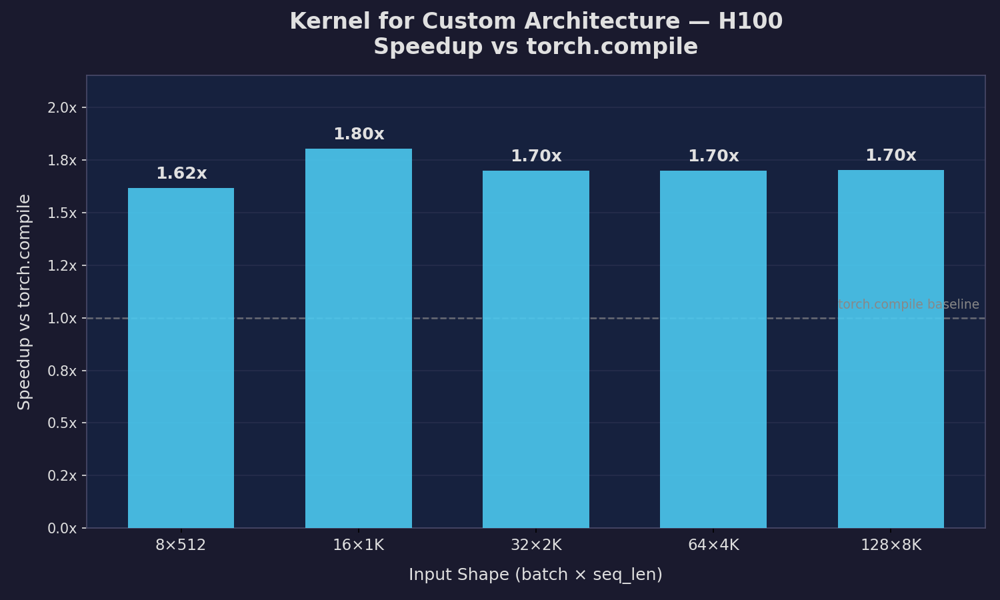
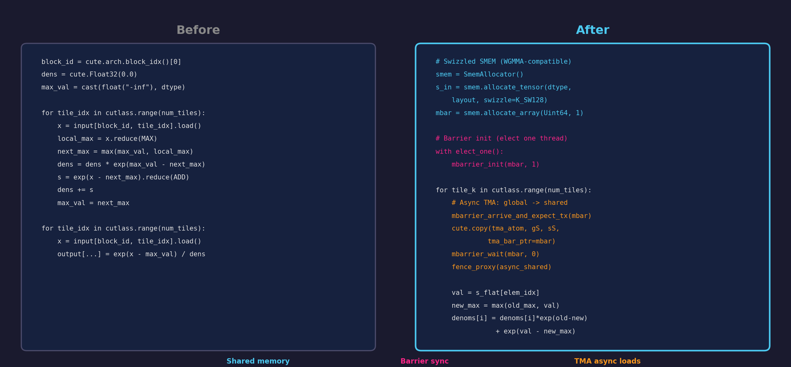

*By [Jack Foxabbott](https://www.linkedin.com/in/foxabbott/), Founding Member of Technical Staff*

# Evolving GPU Kernels with LLMs

*How we use large language models as mutation operators in an evolutionary algorithm to discover optimised GPU kernels -- and why controlling diversity is still the key.*

---

In the [previous post](../evolution-diversity/post.md), we showed that diversity is the secret ingredient in evolutionary algorithms. Too little and the population collapses to a local optimum. Too much and it wanders randomly. Get the balance right and you provably converge to the global optimum in polynomial time.

That was on a continuous function in $\mathbb{R}^2$. Now the individuals are not points on a heatmap but *programs* -- specifically, GPU kernels -- and the search space is the space of all valid code.

The diversity story carries over, and it matters more here: the search space is harder, evaluation is expensive, and most random changes to code are destructive.

## The Problem: GPU Kernels Are Hard

Writing fast GPU kernels is one of the most demanding tasks in software engineering. Everything is coupled: tiling strategy, occupancy, register pressure, memory access patterns. A small change to one dimension can cause a performance cliff in another. And what's optimal on an H200 may be suboptimal on a B200.

The search space is combinatorial. For any given operation, you're choosing among data types, input shapes, target devices, and an infinite space of algorithmic rewrites. Layer on multiple objectives -- latency, memory usage, numerical accuracy -- and you have a Pareto frontier, not a single answer.

This is exactly the kind of problem evolutionary algorithms are built for: huge, multi-modal search spaces where gradient information is unavailable. But there's a catch.

## Classical Genetic Programming Breaks Code

The traditional approach to evolving programs is [genetic programming](https://en.wikipedia.org/wiki/Genetic_programming) (GP): represent programs as syntax trees and apply random structural mutations -- swap a subtree, change an operator, delete a node.

The problem is that random structural mutations almost always produce broken code. Here's a simple example: take a function that computes Euclidean distance and apply five classical GP mutations to it.

```python
def distance(x1, y1, x2, y2):
    dx = x2 - x1
    dy = y2 - y1
    return sqrt(dx*dx + dy*dy)
```

| Mutation | What It Does | Result |
|----------|-------------|--------|
| Point mutation | Replace `sqrt` with `[qrt` | `SyntaxError: invalid syntax` |
| Subtree crossover | Swap line order | `IndentationError: unexpected indent` |
| Subtree mutation | Replace `dy*dy` with `len([y2])` | Wrong result: 3.16 (expected 5.0) |
| Operator mutation | Replace `-` with `>>` | Wrong result: 4.0 (expected 5.0) |
| Node deletion | Remove `dy = y2 - y1` | `NameError: name 'dy' is not defined` |

**5 out of 5 mutations break the code.** This isn't bad luck -- it's the norm. Most of the search budget in classical GP is wasted on programs that don't even parse, let alone produce correct results.


In the language of the previous post: classical GP mutations destroy the *ergodicity* condition in practice. Technically, random mutations *can* reach any program given infinite time. But the probability of a useful mutation is so vanishingly small that you'd need exponential time to find one -- exactly the regime [Dang et al. (2016)](https://doi.org/10.1007/978-3-319-45823-6_13) showed leads to exponential escape times.

## LLMs: The Ideal Mutation Operator

Large language models fix this. Instead of random structural perturbations, an LLM can:

- **Understand code semantics**, so mutations are *meaningful*, not random.
- **Read documentation and hardware specs** to guide changes toward known optimisation strategies.
- **Produce code that compiles and runs.** Most LLM-generated mutations are syntactically valid.
- **Control diversity directly via temperature.** Low temperature produces conservative edits; high temperature produces radical rewrites.

In evolutionary terms, LLMs give you **structured diversity** -- meaningful variation in the algorithm dimension while maintaining stability in the syntax dimension. They satisfy the ergodicity condition *practically*, not just theoretically: an LLM can generate any valid kernel, and it does so with high enough probability that escape from local optima happens in reasonable time.

LLMs add diversity where it matters (algorithmic choices) and stability where it matters (code correctness).

## Why Kernels Are Especially Hard

Even with LLMs as the mutation operator, kernel optimisation presents unique challenges:

- **Compilation cost.** Each candidate must compile, often with expensive autotuning. You can't evaluate thousands of candidates cheaply.
- **Hardware specificity.** The optimal kernel for one GPU architecture may be suboptimal for another.
- **Correctness validation.** Fast but wrong is worthless. Every variant needs numerical verification against a reference implementation.
- **Multiple objectives.** Speed, memory, and numerical precision are all in tension.
- **DSL complexity.** GPU domain-specific languages (Triton, CuTe/CUTLASS, Helion) are niche and under-represented in LLM training data. Mutations need documentation-grounded guidance, not just pattern matching.

Every evaluation is expensive, which means every mutation must count. This makes diversity management even more critical than in the Rastrigin example: you can't afford to waste your evaluation budget on redundant or random candidates.

## Our System: Neural Kernel Search

The system follows a standard evolutionary loop, with LLM-powered mutation:

```
Population --> LLM Mutation --> Validation --> Profiling --> Selection
    ^                                                          |
    +----------------------------------------------------------+
```

### The LLM Mutation Pipeline

Each mutation attempt passes through a multi-stage pipeline:

```
Plan --> Doc Read --> Coding --> Compile --> Correctness --> Profile
                                   |             |
                                   v             v
                                 [fail]        [fail]
                                   \            /
                                    --> Debug ---> (retry Coding)
```

1. **Plan.** The LLM generates a high-level optimisation strategy for this mutation (e.g., "try TMA async loads to overlap memory transfers with computation").
2. **Doc Read.** The LLM reads relevant documentation for the target DSL and hardware.
3. **Coding.** The LLM writes the mutated kernel.
4. **Compile.** The kernel is compiled. If compilation fails, a debug agent diagnoses the error and retries from the coding stage.
5. **Correctness.** The kernel is tested against a reference implementation. If it produces wrong results, the debug agent retries.
6. **Profile.** The kernel is benchmarked. Fitness = geometric mean speedup vs `torch.compile` across a range of input shapes.

### Controlling Diversity: Five Knobs

Just as in the Rastrigin example, diversity is controlled by tuning multiple knobs simultaneously. Here are the five we use:

| Knob | Low Diversity | High Diversity |
|------|--------------|----------------|
| **Selection pressure** | Only top-1 parent | Uniform random parent |
| **Population size** | Few candidates, many generations | Many candidates, fewer generations |
| **LLM temperature** | Low (conservative edits) | High (radical rewrites) |
| **Planning prompts** | Single plan shared across the generation | Unique plan per attempt |
| **Insight sharing** | Full history shared with all agents | No sharing between agents |

The strategy: **explore broadly early, exploit the best later.** In early generations, we use high temperature, diverse planning prompts, and weak selection to maximise the variety of kernel strategies explored. In later generations, we tighten selection, lower temperature, and share insights, focusing the population on refining the most promising approaches.

One open problem: **measuring diversity of kernels is not well-defined.** For points in $\mathbb{R}^2$, we can compute pairwise distances. For kernel code, it's much less clear. AST distance? Algorithmic similarity? Performance profile distance? There's no consensus, and this remains an active research question.

## Results: 1.6--1.8x Faster Than torch.compile

We used this system to evolve a kernel for a custom neural architecture on NVIDIA H100 GPUs. The target operation was a fused LoRA + RoPE kernel -- something no standard library provides and `torch.compile` can't specialise for.



Across five input shapes, the evolved kernel consistently achieves **1.6--1.8x speedup** over `torch.compile`:

| Input Shape | torch.compile (ms) | Evolved Kernel (ms) | Speedup |
|-------------|--------------------|--------------------|---------|
| 8 x 512     | 0.087              | 0.054              | 1.62x   |
| 16 x 1K     | 0.319              | 0.177              | 1.80x   |
| 32 x 2K     | 1.165              | 0.686              | 1.70x   |
| 64 x 4K     | 4.551              | 2.680              | 1.70x   |
| 128 x 8K    | 18.128             | 10.653             | 1.70x   |

### What the System Discovered

Starting from a naive online softmax kernel with direct global memory loads and scalar accumulation, the system discovered Hopper-specific optimisations including:

- **TMA async bulk loads** -- overlapping global-to-shared memory transfers with computation.
- **Swizzled shared memory layouts** compatible with WGMMA (Warp Group Matrix Multiply-Accumulate).
- **Barrier-based synchronisation** using `mbarrier` instead of `__syncthreads`.



The core math is identical. The data movement is completely different. This required deep knowledge of Hopper's memory hierarchy that the LLM discovered through iterative mutation and selection -- not through a single-shot prompt.

## Connecting Back to Theory

Recall [Rudolph's (1994)](https://doi.org/10.1109/TNNLS.1994.283510) three conditions for guaranteed convergence to the global optimum:

| Condition | How Our System Satisfies It |
|-----------|-----------------------------|
| **Elitism** | We always keep the best kernels across generations. |
| **Ergodicity** | LLMs can generate any valid kernel -- and unlike random mutation, they do so with practical probability. |
| **Selection pressure** | Faster kernels are more likely to survive to the next generation. |

And recall [Dang et al.'s (2016)](https://doi.org/10.1007/978-3-319-45823-6_13) result: **diversity reduces escape time from exponential to polynomial.**

Our system satisfies all three convergence conditions. The LLM makes ergodicity *practical* -- it concentrates mutations on promising directions while maintaining the theoretical ability to reach any valid kernel. And the diversity knobs (temperature, planning prompts, insight sharing) give us direct control over the exploration--exploitation tradeoff that Dang et al. showed is the difference between polynomial and exponential convergence.

The key insight: **how we manage diversity determines how fast we converge.** The theoretical guarantee of eventual convergence (Rudolph) is only useful if the convergence time is reasonable (Dang et al.). And the convergence time is only reasonable if the population maintains the right level of diversity at the right time.

## What's Next

Kernel evolution is still early. Some open directions:

- **Better diversity metrics for code.** How do you measure the "spread" of a population of kernel implementations? Solving this would let us adaptively control diversity the way we adaptively control mutation strength in the Rastrigin example.
- **Multi-objective Pareto evolution.** Currently we optimise primarily for latency. Extending to explicit Pareto frontiers over latency, memory, and numerical precision would better match real deployment constraints.
- **Transfer across architectures.** Can a population evolved on H100 seed the search on B200, bootstrapping the process instead of starting from scratch?

Whether the individuals are points in $\mathbb{R}^2$ or GPU kernels in CuTe DSL, the same principle applies: **controlling diversity is the key to efficient evolutionary search.** LLMs make it practical.

---

*All code to generate the figures in this post is available at [github.com/GeometricAGI/blog](https://github.com/GeometricAGI/blog).*

## References

1. G. Rudolph. *Convergence Analysis of Canonical Genetic Algorithms.* IEEE Transactions on Neural Networks, 5(1):96--101, 1994. [doi:10.1109/TNNLS.1994.283510](https://doi.org/10.1109/TNNLS.1994.283510)

2. D.-C. Dang, T. Jansen, P.K. Lehre, P.S. Oliveto, D. Sudholt. *Escaping Local Optima using Crossover with Mutation.* Parallel Problem Solving from Nature (PPSN XIV), pp. 160--170, 2016. [doi:10.1007/978-3-319-45823-6_13](https://doi.org/10.1007/978-3-319-45823-6_13)

3. J.R. Koza. *Genetic Programming: On the Programming of Computers by Means of Natural Selection.* MIT Press, 1992.

4. M. Chen, J. Tworek, H. Jun, et al. *Evaluating Large Language Models Trained on Code.* arXiv:2107.03374, 2021.
