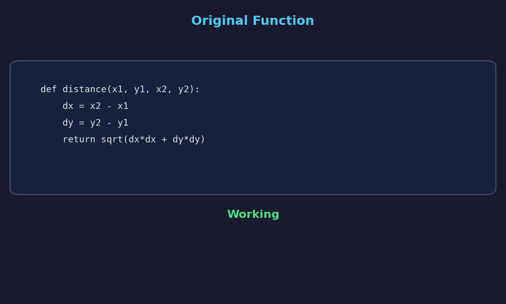

*By [Jack Foxabbott](https://www.linkedin.com/in/foxabbott/), Founding Member of Technical Staff*

# Evolving GPU Kernels with LLMs

*Large language models turn evolutionary program synthesis from theory into practice. Here's the argument from first principles.*

---

In the [previous post](../evolution-diversity/post.md), we showed that diversity is the critical variable in evolutionary algorithms. Too little and the population collapses to a local optimum. Too much and it wanders randomly. Get the balance right and you provably converge to the global optimum in polynomial time.

That was on a continuous function in $\mathbb{R}^2$. Now the individuals are not points on a heatmap but *programs* (specifically, GPU kernels) and the search space is the space of all valid code.

The diversity story carries over, and it matters more here: the search space is harder, evaluation is expensive, and most random changes to code are destructive.

## GPU kernels are hard

Writing fast GPU kernels is one of the most demanding tasks in software engineering. Everything is coupled: tiling strategy, occupancy, register pressure, memory access patterns. A small change to one dimension can cause a performance cliff in another. What's optimal on an H200 may be suboptimal on a B200.

The search space is combinatorial. For any given operation, you're choosing among data types, input shapes, target devices, and an infinite space of algorithmic rewrites. Layer on multiple objectives (latency, memory usage, numerical accuracy) and you have a Pareto frontier, not a single answer.

This is exactly the kind of problem evolutionary algorithms are built for: huge, multi-modal search spaces where gradient information is unavailable. But there's a catch.

## Classical genetic programming breaks code

The traditional approach to evolving programs is [genetic programming](https://en.wikipedia.org/wiki/Genetic_programming) (GP): represent programs as syntax trees and apply random structural mutations: swap a subtree, change an operator, delete a node.

Random structural mutations almost always produce broken code. Take a function that computes Euclidean distance and apply five classical GP mutations:

```python
def distance(x1, y1, x2, y2):
    dx = x2 - x1
    dy = y2 - y1
    return sqrt(dx*dx + dy*dy)
```

| Mutation | What it does | Result |
|----------|-------------|--------|
| Point mutation | Replace `sqrt` with `[qrt` | `SyntaxError: invalid syntax` |
| Subtree crossover | Swap line order | `IndentationError: unexpected indent` |
| Subtree mutation | Replace `dy*dy` with `len([y2])` | Wrong result: 3.16 (expected 5.0) |
| Operator mutation | Replace `-` with `>>` | Wrong result: 4.0 (expected 5.0) |
| Node deletion | Remove `dy = y2 - y1` | `NameError: name 'dy' is not defined` |

**5 out of 5 mutations break the code.** This is the norm. Most of the search budget in classical GP goes to programs that don't even parse, let alone produce correct results.



In the language of the previous post: classical GP mutations destroy the *ergodicity* condition in practice. Random mutations *can* reach any program given infinite time, but the probability of a useful mutation is so small that you need exponential time to find one (exactly the regime [Dang et al. (2016)](https://doi.org/10.1145/2908812.2908956) showed leads to exponential escape times).

## LLMs as mutation operators

Large language models fix this. Instead of random structural perturbations, an LLM can:

- **Understand code semantics**, so mutations are *meaningful*, not random.
- **Read documentation and hardware specs** to guide changes toward known optimisation strategies.
- **Produce code that compiles and runs.** Most LLM-generated mutations are syntactically valid.
- **Control diversity directly via temperature.** Low temperature produces conservative edits; high temperature produces radical rewrites.

This approach has become widespread. [Lehman et al. (2022)](https://arxiv.org/abs/2206.08896) introduced Evolution through Large Models (ELM), showing that LLMs trained on code can serve as mutation operators for genetic programming, generating hundreds of thousands of functional programs in a domain absent from training data. [Meyerson et al. (2024)](https://arxiv.org/abs/2302.12170) formalised why this works: LLM-based crossover implicitly builds a probabilistic model of parent genotypes and samples offspring, connecting it to Estimation of Distribution Algorithms (EDAs). The pre-trained distribution concentrates mass on syntactically valid, semantically coherent programs, so most mutations stay in a productive neighbourhood.

Google DeepMind's [FunSearch (Romera-Paredes et al., 2024)](https://www.nature.com/articles/s41586-023-06924-6) applied this to mathematical discovery, pairing an LLM with an evaluator in an island-based evolutionary loop to find new constructions for the cap set problem. Its successor [AlphaEvolve (Novikov et al., 2025)](https://arxiv.org/abs/2506.13131) operates directly on code diffs and achieved a 23% speedup on a critical Gemini training kernel. Sakana AI's [ShinkaEvolve (Lange et al., 2025)](https://arxiv.org/abs/2509.19349) pushed sample efficiency further, finding state-of-the-art circle packing solutions in roughly 150 evaluations using novelty rejection-sampling and bandit-based LLM ensemble selection.

In evolutionary terms, LLMs give you **structured diversity**: meaningful variation in algorithmic choices while maintaining syntactic stability. They satisfy the ergodicity condition *practically*, not just theoretically. An LLM can generate any valid program, and it does so with high enough probability that escape from local optima happens in reasonable time.

## Why kernels make the problem harder

Even with LLMs as the mutation operator, kernel optimisation presents challenges that amplify the importance of diversity management:

- **Compilation cost.** Each candidate must compile, often with expensive autotuning. You can't evaluate thousands of candidates cheaply.
- **Hardware specificity.** The optimal kernel for one GPU architecture may be suboptimal for another.
- **Correctness validation.** Fast but wrong is worthless. Every variant needs numerical verification against a reference implementation.
- **Multiple objectives.** Speed, memory, and numerical precision are all in tension.
- **DSL complexity.** GPU domain-specific languages (Triton, CuTe/CUTLASS, Helion) are niche and under-represented in LLM training data. Mutations need documentation-grounded guidance, not just pattern matching.

Every evaluation is expensive, which means every mutation must count. You can't afford to waste budget on redundant or random candidates.

## Satisfying the convergence conditions

Consider what an LLM-based kernel evolution system looks like through the lens of [Rudolph's (1994)](https://doi.org/10.1109/72.265964) convergence result. Recall: an EA with elitism and an ergodic mutation operator converges to the global optimum almost surely.

**Elitism** is straightforward: always keep the best kernels across generations. Never discard a kernel that's faster than everything else you've seen.

**Ergodicity** is where LLMs make the difference. Classical GP has theoretical ergodicity (random mutations can reach any program) but not practical ergodicity (the probability of a useful mutation is negligibly small). An LLM concentrates probability mass on syntactically valid, semantically meaningful programs. It can still reach any valid kernel (the temperature dial ensures that) but it does so with practical probability rather than astronomically small probability. This is the difference between ergodicity that gives you convergence in polynomial time and ergodicity that gives you convergence in exponential time.

It helps to think about two competing clocks. The **takeover clock** measures how quickly selection fills the population with copies of the current best. This is pure exploitation, and it runs at a rate dictated by tournament size and population structure. The **escape clock** measures how quickly mutations can produce something genuinely different: a new algorithmic strategy, a gap-crossing move. LLMs speed up the escape clock dramatically, because meaningful mutations happen with practical probability, not astronomically small probability. But the takeover clock is unchanged. The design problem is ensuring escape stays ahead of takeover long enough to discover the right algorithmic basin.

And recall [Dang et al.'s (2016, 2018)](https://doi.org/10.1109/TEVC.2017.2724201) result: on problems with deceptive local optima, maintaining population diversity is what turns exponential escape time into polynomial escape time. For kernel evolution, diversity means the population contains genuinely different algorithmic strategies (not just minor parameter variations of the same approach).

## Controlling diversity in practice

Just as in the Rastrigin example from the previous post, diversity in an LLM-based evolutionary system is controlled by tuning multiple knobs:

| Knob | Low diversity | High diversity |
|------|--------------|----------------|
| **Selection pressure** | Only top-1 parent | Uniform random parent |
| **Population size** | Few candidates, many generations | Many candidates, fewer generations |
| **LLM temperature** | Low (conservative edits) | High (radical rewrites) |
| **Planning prompts** | Single plan shared across the generation | Unique plan per mutation attempt |
| **Insight sharing** | Full history shared with all agents | No sharing between agents |

The general strategy mirrors the Rastrigin example: **explore broadly early, exploit the best later.** In early generations, high temperature, diverse planning prompts, and weak selection maximise the variety of kernel strategies explored. In later generations, tighter selection, lower temperature, and shared insights focus the population on refining the most promising approaches.

Temperature is particularly interesting because it maps directly onto the exploration/exploitation tradeoff that [Dang et al.](https://doi.org/10.1145/2908812.2908956) showed determines convergence speed. High temperature increases the effective mutation step size, helping the population explore diverse algorithmic strategies and escape local optima. Low temperature keeps mutations conservative, refining solutions that already work. This is the continuous-code analogue of the adaptive mutation schedule ($\sigma(t) = 1.2 \cdot (1 - 0.8 \cdot t/T)$) we used on the Rastrigin function.

Insight sharing plays the role of *crossover*. When one agent's successful strategy informs another agent's mutations, the LLM is recombining partial solutions from different parents. [Dang et al. (2016, 2018)](https://doi.org/10.1109/TEVC.2017.2724201) proved that this kind of recombination turns exponential escape time into polynomial on hard landscapes, but only when the parents are genuinely diverse. If all agents have converged to variations of the same tiling strategy, sharing between them is recombining near-clones, which is provably useless. Diverse planning prompts are what create the variation that makes insight sharing productive in the first place.

One open problem: **measuring diversity of kernels is not well-defined.** For points in $\mathbb{R}^2$, you compute pairwise distances. For kernel code, there's no consensus. AST distance? Algorithmic similarity? Performance profile distance? Without a good diversity metric, you can't adaptively control diversity the way [Doerr, Giessen, and Witt (2019)](https://doi.org/10.1007/s00453-018-0502-x) showed is optimal for simpler search spaces. This remains an active research question.

## What the literature shows

The empirical results from LLM-based evolutionary systems are striking. AlphaEvolve discovered a 4x4 complex matrix multiplication algorithm using 48 scalar multiplications, improving on Strassen (1969), and sped up a critical Gemini training kernel by 23%. FunSearch found new constructions for the cap set problem (the largest improvement on the asymptotic lower bound in 20 years). [KernelBench (Ouyang et al., 2025)](https://arxiv.org/abs/2502.10517) established that LLMs can generate correct CUDA kernels, though optimality remains challenging for single-shot generation, exactly the gap that evolutionary iteration fills.

These results share a pattern: the LLM alone isn't enough. Single-shot prompting produces reasonable but rarely optimal code. It's the evolutionary loop (iterative mutation, selection, and diversity management) that pushes performance past what any single LLM call achieves. The LLM provides structured diversity; the evolutionary algorithm provides the search discipline to use it well.

## What we're doing

At Geometric, we use these ideas to evolve GPU kernels. We'll have more to say about our system and results in a future post.

The theoretical argument from the previous post carries through: whether the individuals are points in $\mathbb{R}^2$ or GPU kernels in CuTe DSL, **controlling diversity is the key to efficient evolutionary search.** LLMs make the theory practical by satisfying the ergodicity condition with meaningful probability, and temperature gives a direct dial on the exploration/exploitation tradeoff that determines convergence speed.

---

## References

1. G. Rudolph. *Convergence Analysis of Canonical Genetic Algorithms.* IEEE Transactions on Neural Networks, 5(1):96--101, 1994. [doi:10.1109/72.265964](https://doi.org/10.1109/72.265964)

2. D.-C. Dang, T. Friedrich, M. Kötzing, M.S. Krejca, P.K. Lehre, P.S. Oliveto, D. Sudholt, A.M. Sutton. *Escaping Local Optima with Diversity Mechanisms and Crossover.* GECCO 2016, pp. 645--652. [doi:10.1145/2908812.2908956](https://doi.org/10.1145/2908812.2908956)

3. D.-C. Dang et al. *Escaping Local Optima using Crossover with Emergent Diversity.* IEEE Transactions on Evolutionary Computation, 22(3):484--497, 2018. [doi:10.1109/TEVC.2017.2724201](https://doi.org/10.1109/TEVC.2017.2724201)

4. J. Lehman, J. Gordon, S. Jain, K. Ndousse, C. Yeh, K.O. Stanley. *Evolution through Large Models.* arXiv:2206.08896, 2022.

5. E. Meyerson, M.J. Nelson, H. Bradley, A. Gaier, A. Moradi, A.K. Hoover, J. Lehman. *Language Model Crossover: Variation through Few-Shot Prompting.* ACM Transactions on Evolutionary Learning and Optimization, 2024. [arXiv:2302.12170](https://arxiv.org/abs/2302.12170)

6. B. Romera-Paredes et al. *Mathematical Discoveries from Program Search with Large Language Models.* Nature, 625:468--475, 2024.

7. A. Novikov et al. *AlphaEvolve: A Coding Agent for Scientific and Algorithmic Discovery.* arXiv:2506.13131, 2025.

8. J.R. Koza. *Genetic Programming: On the Programming of Computers by Means of Natural Selection.* MIT Press, 1992.

9. A. Ouyang et al. *KernelBench: Can LLMs Write Efficient GPU Kernels?* ICML 2025. [arXiv:2502.10517](https://arxiv.org/abs/2502.10517)

10. B. Doerr, C. Giessen, C. Witt. *The (1+λ) Evolutionary Algorithm with Self-Adjusting Mutation Rate.* Algorithmica, 81:593--631, 2019. [doi:10.1007/s00453-018-0502-x](https://doi.org/10.1007/s00453-018-0502-x)

11. R.T. Lange, Y. Imajuku, E. Cetin. *ShinkaEvolve: Towards Open-Ended and Sample-Efficient Program Evolution.* arXiv:2509.19349, 2025.
